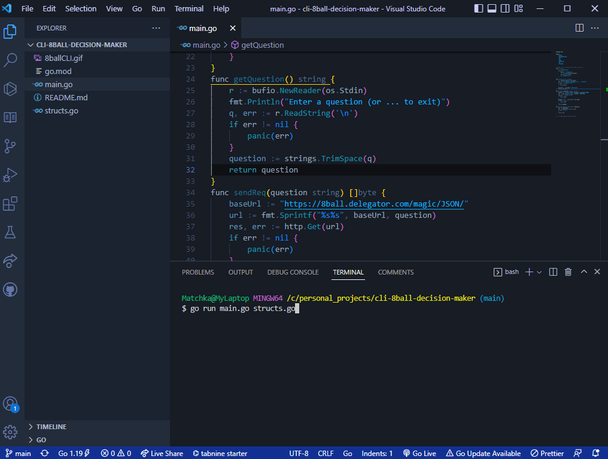

# 8ball-decision-maker-CLI
_"Why waste time make big decision when API do the trick ?"_ - Aristotle, probably

Type in a question and receive _an answer*_ for free !

## Usage GIF:

 

This project is done to practice making a basic HTTP get request and processing a JSON response into a struct variable !

 

*Accuracy not guaranteed ... 